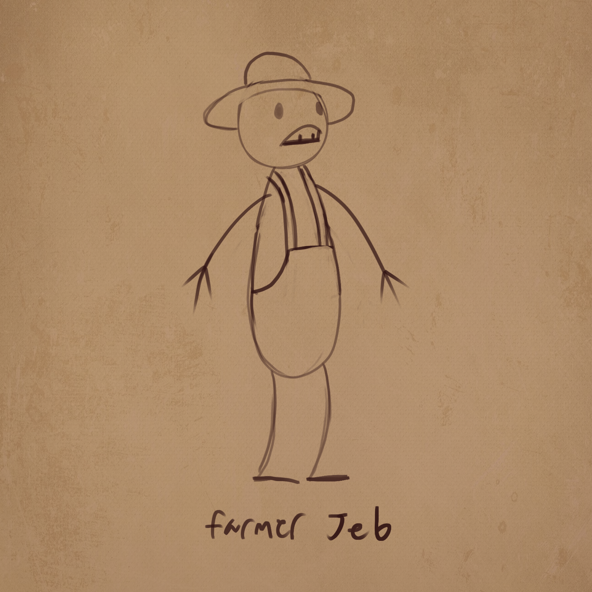

----
Hello, my name is Daniel Steele. I am an artist with a deep love for the 3D process, loving it as a hobby even before I decided to do it for a living. I have a bachelors of science in Game Art and Design, I specialise in 3D character art; but over the years I've also grown an equal love for the rigging and animation pipeline as well. On this website you can find art peices i've worked on over the years as well as demonstrations of my auto rigging tools. My primary tool of the trade is Autodesk Maya, but I have a full understanding of the game art pipeline from zbrush, to unwrapping, to texturing. I also have a full understanding of the maya to unreal/unity rigging pipeline.

+My program capabilities include, but are not limited to
  Autodesk Maya
  3DS Max
  Adobe Photoshop
  Substance Painter/designer
  marvelous designer
  3Dcoat

----

  ## Links

[link text](https://dasteel420.github.io/DanielSteele3D.github.io/)

[link with title](https://dasteel420.github.io/DanielSteele3D.github.io/ "title text!")

## Images

## The End!
 
